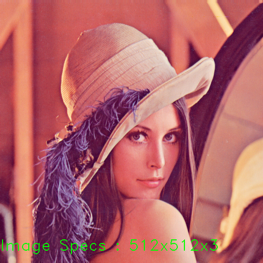

<style>
h1, h2, h3
{
font-family: "Inria Serif", Times, serif;
    font-variant-ligatures: common-ligatures;
}

body{
    font-family: "IBM Plex Sans", sans-serif;
    font-variant-ligatures: common-ligatures;
}
</style>

# <center>Shri Ramdeobaba College of Engineering and Management<br>Nagpur, 440013</center>

## <center>Department of Computer Engineering</center>

### <center>FDVIP Lab</center>

---

**Name** : _Shantanu Mane_<br>
**Roll No.** : _E63_<br>
**Batch** : _CSE-AIML_<br>
**Date** : _22/2/2023_<br>

---

### AIM - To study and perform basic operations used in image processing.

1. Reading an image.
2. Displaying an image in color mode.
3. Displaying an image in grayscale mode.
4. Saving an image

---

## Importing Dependencies

```python
import cv2
import numpy as np
```

## 1. Reading an image

### 1.A. Reading an Image in Color Mode

```python
lena_image = cv2.imread('../data/lena.png', 1)

cv2.imshow('Lena', lena_image)
```

### 1.B. Reading an Image in Grayscale Mode

```python
lena_image_gray = cv2.imread('../data/lena.png', cv2.IMREAD_GRAYSCALE)  # 0 instead of cv2.IMREAD_GRAYSCALE

cv2.imshow('Lena', lena_image_gray)
```

### Output

|      Original Image      |      Grayscale Image       |
|:------------------------:|:--------------------------:|
|  |  |

## 2. Displaying an image in color mode

```python
cv2.imshow('Lena', lena_image)
```

## 3. Displaying an image in grayscale mode

```python
cv2.imshow('Lena', lena_image_gray)
```

## 4. Saving an image

```python
cv2.imwrite('../data/lena_og.png', lena_image)
cv2.imwrite('../data/lena_gray.png', lena_image_gray)
```