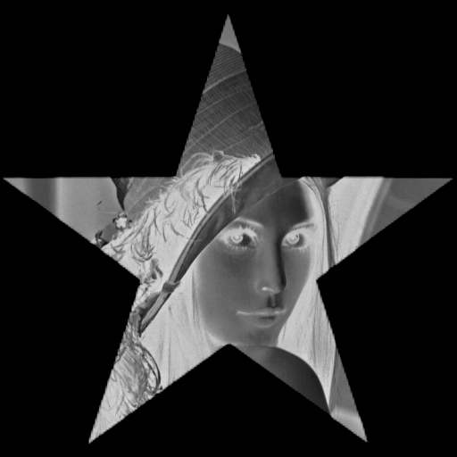
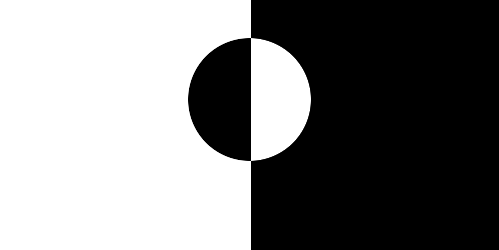

<style>
h1, h2, h3
{
font-family: "Inria Serif", Times, serif;
    font-variant-ligatures: common-ligatures;
}

body{
    font-family: "IBM Plex Sans", sans-serif;
    font-variant-ligatures: common-ligatures;
}
</style>

# <center>Shri Ramdeobaba College of Engineering and Management<br>Nagpur, 440013</center>

## <center>Department of Computer Engineering</center>

### <center>FDVIP Lab</center>

---

**Name** : _Shantanu Mane_<br>
**Roll No.** : _E63_<br>
**Batch** : _CSE-AIML_<br>
**Date** : _1/3/2023_<br>

---

### AIM - To study and perform basic arithmetic and logical operations used in image processing.

| S.No. | Arithmetic Operations | Logical Operations |
|:-----:|:---------------------:|:------------------:|
|  1.   |       Addition        |        AND         |
|  2.   |      Subtraction      |         OR         |
|  3.   |    Multiplication     |        XOR         |
|  4.   |       Division        |        NOT         |

---

## Importing Dependencies

```python
import cv2
import numpy as np
```

## Reading the images

```python
# For Arithmetic Operations
img_lena = cv2.imread('../data/lena.png', 0)
img_star = cv2.imread('../data/star.png', 0)

# For Logical Operations
img_circle = cv2.imread('../data/circle.png', 0)
img_square = cv2.imread('../data/square.png', 0)
```

## 1. Arithmetic Operations

### 1.A. Addition

```python
img_add = cv2.add(img_lena, img_star)
cv2.imshow('Addition', img_add)
```

### 1.B. Subtraction

```python   
img_sub = cv2.subtract(img_lena, img_star)
cv2.imshow('Subtraction', img_sub)
```

### 1.C. Multiplication

```python
img_mul = cv2.multiply(img_lena, img_star)
cv2.imshow('Multiplication', img_mul)
```

### 1.D. Division

```python
img_div = cv2.divide(img_lena, img_star)
cv2.imshow('Division', img_div)
```

### 1.C.i Scaling UP

```python
img_mul_scaled = cv2.multiply(img_lena, img_star, scale=2)
cv2.imshow('Multiplication Scaled', img_mul_scaled)
```

### 1.C.ii Scaling DOWN

```python
img_mul_scaled = cv2.multiply(img_lena, img_star, scale=0.5)
cv2.imshow('Multiplication Scaled', img_mul_scaled)
```

### Output

|       Addition       |     Subtraction      |    Multiplication    |       Division       |
|:--------------------:|:--------------------:|:--------------------:|:--------------------:|
|  |  |  |  |

| Multiplication Scaled UP | Multiplication Scaled DOWN |
|:------------------------:|:--------------------------:|
|   |    |

## 2. Logical Operations

### 2.A. AND

```python
img_and = cv2.bitwise_and(img_circle, img_square)
cv2.imshow('AND', img_and)
```

### 2.B. OR

```python
img_or = cv2.bitwise_or(img_circle, img_square)
cv2.imshow('OR', img_or)
```

### 2.C. XOR

```python
img_xor = cv2.bitwise_xor(img_circle, img_square)
cv2.imshow('XOR', img_xor)
```

### 2.D. NOT

```python
img_not = cv2.bitwise_not(img_circle)
cv2.imshow('NOT', img_not)
```

### Output

|         AND          |         OR          |         XOR          |         NOT          |
|:--------------------:|:-------------------:|:--------------------:|:--------------------:|
|  |  |  |  |
