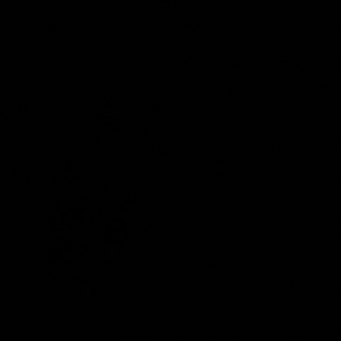

<style>
h1, h2, h3
{
font-family: "Inria Serif", Times, serif;
    font-variant-ligatures: common-ligatures;
}

body{
    font-family: "IBM Plex Sans", sans-serif;
    font-variant-ligatures: common-ligatures;
}
</style>

# <center>Shri Ramdeobaba College of Engineering and Management<br>Nagpur, 440013</center>

## <center>Department of Computer Engineering</center>

### <center>FDVIP Lab</center>

---

**Name** : _Shantanu Mane_<br>
**Roll No.** : _E63_<br>
**Batch** : _CSE-AIML_<br>
**Date** : _8/3/2023_<br>

---

### AIM - To study and perform point-point processing operations used in image enhancement.

1. Negative Transformation
2. Log Transformation
3. Power-Law Transformation
4. Bit Plane Transformation
5. Grey Level Slicing

---

## Importing Dependencies

```python
import cv2
import numpy as np
```

## Reading the images

```python
img = cv2.imread('../data/cameraman.jpg', 0)
```

## 1. Negative Transformation

```python
img_neg = 255 - img
cv.imshow('Negative Transformation', img_neg)
```

### Output

|  |
|:--------------------:|
|    Negative Image    |

## 2. Log Transformation

```python
c = 255 / np.log(1 + np.max(img))
img_log = c * np.log(1 + img)
img_log = np.array(img_log, dtype=np.uint8)
cv.imshow('Log Transformation', img_log)
```

### Output

|  |
|:--------------------:|
|  Log Transformation  |

## 3. Power-Law Transformation

```python
c = 255 / (np.max(img) ** 0.5)
img_pow = c * (img ** 0.5)
img_pow = np.array(img_pow, dtype=np.uint8)
cv.imshow('Power-Law Transformation', img_pow)
```

### Output

|  |  |  |
|:-----------------------:|:-----------------------:|:-----------------------:|
|       Gamma = 1.0       |       Gamma = 2.0       |       Gamma = 3.0       |

## 4. Bit Plane Transformation

```python
img_bit = np.zeros(img.shape, dtype=np.uint8)
for i in range(8):
    img_bit = img_bit + ((img >> i) & 1) * (2 ** i)
cv.imshow('Bit Plane Transformation', img_bit)
```

### Output

|            image            |            image            |            image            |            image            |
|:---------------------------:|:---------------------------:|:---------------------------:|:---------------------------:|
|  |  |  |  |
|         bit plane 1         |         bit plane 2         |         bit plane 3         |         bit plane 4         |
|  |  |  |  |
|         bit plane 5         |         bit plane 6         |         bit plane 7         |         bit plane 8         |

## 5. Grey Level Slicing

```python
img_slice = np.zeros(img.shape, dtype=np.uint8)
img_slice[(img >= 100) & (img <= 200)] = 255
cv.imshow('Grey Level Slicing', img_slice)
```

### Output

|  |
|:-------------------:|
| Grey Level Slicing  |