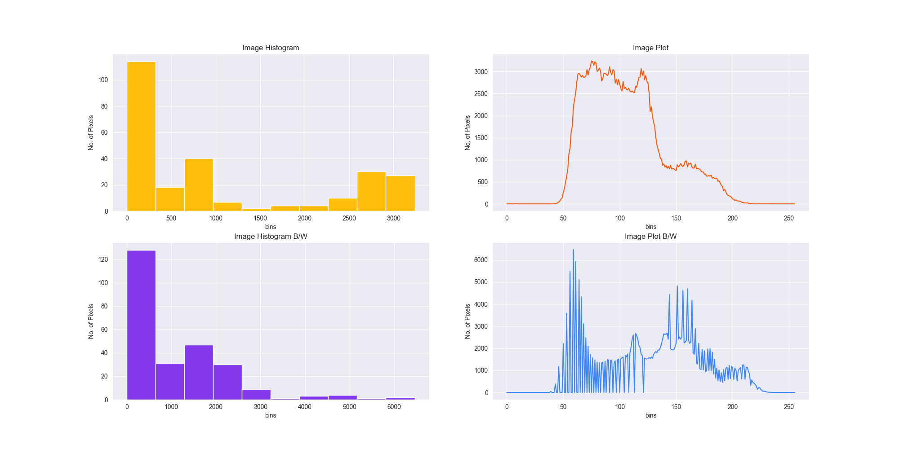
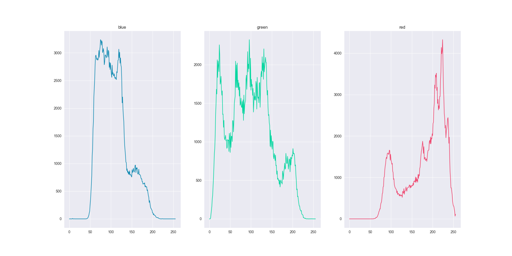
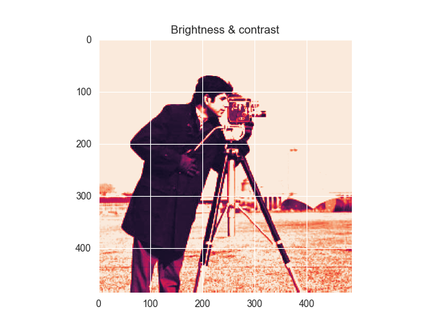
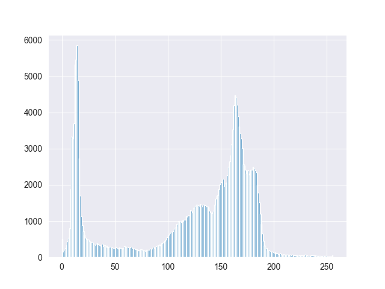
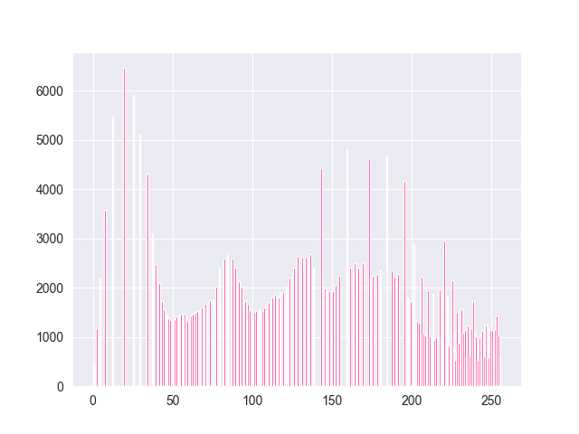

<style>
h1, h2, h3
{
font-family: "Inria Serif", Times, serif;
    font-variant-ligatures: common-ligatures;
}

body{
    font-family: "IBM Plex Sans", sans-serif;
    font-variant-ligatures: common-ligatures;
}
</style>

# <center>Shri Ramdeobaba College of Engineering and Management<br>Nagpur, 440013</center>

## <center>Department of Computer Engineering</center>

### <center>FDVIP Lab</center>

---

**Name** : _Shantanu Mane_<br>
**Roll No.** : _E63_<br>
**Batch** : _CSE-AIML_<br>
**Date** : _15/3/2023_<br>

---

### AIM - To study and perform Histogram processing in image enhancement.

1. Plot a Histogram of Grayscale and Color Image
2. Contrast and Brightness stretching of Grayscale image
3. Perform Histogram Equalization on Grayscale image

---

## Importing Dependencies

```python
import cv2
import matplotlib.pyplot as plt
import numpy as np
import seaborn as sns

sns.set_style('darkgrid')
colors = ["#ffbe0b", "#fb5607", "#ff006e", "#8338ec", "#3a86ff"]
rgb = ["#118ab2", "#06d6a0", "#ef476f"]
```

## Reading the images

```python
img = cv2.imread('../data/cameraman.jpg', 0)
img_color = cv2.imread('../data/cameraman.jpg')
```

## 1. Plot a Histogram of Grayscale and Color Image

### Grayscale Image

```python
plt.hist(img.ravel(), 256, [0, 256])
plt.show()
```

### Output



### Color Image

```python
plt.figure(figsize=(20, 10))
for i, col in enumerate(['blue', 'green', 'red']):
    histogram = cv2.calcHist([lena_image], [i], None, [256], [0, 256])
    plt.subplot(1, 3, i + 1)
    plt.title(col)
    plt.plot(histogram, color=rgb[i])
plt.show()
```

### Output



## 2. Contrast and Brightness stretching of Grayscale image

### Contrast Stretching

```python
img_stretch = cv2.normalize(img, None, 0, 255, cv2.NORM_MINMAX)
plt.hist(img_stretch.ravel(), 256, [0, 256])
plt.show()
```

### Output



### Brightness Stretching

```python
img_stretch = cv2.convertScaleAbs(img, alpha=1.5, beta=50)
plt.hist(img_stretch.ravel(), 256, [0, 256])
plt.show()
```

### Output



## 3. Perform Histogram Equalization on Grayscale image

```python
img_eq = cv2.equalizeHist(img)
plt.hist(img_eq.ravel(), 256, [0, 256])
plt.show()
```

### Output

